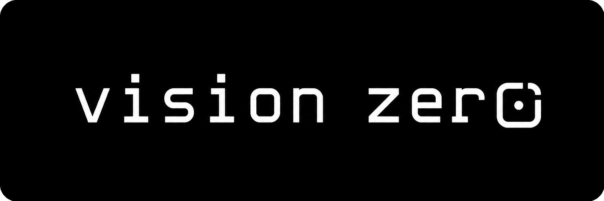

  

<h1 align="center">Vision Zero</h1>

  <strong>An AI brain that delegates instead of doing everything itself.</strong>

  
  
  
  
  

  <a href="https://vision-zero.sh">vision-zero.sh</a>

## What Is Vision Zero?

Vision Zero is a delegation-first AI brain for coding and technical work.

Instead of giving one main agent every tool, connector, memory source, and document, Vision Zero keeps the main brain focused on the human. The brain understands the goal, chooses the right specialist agents, and brings back only the information needed to move forward.

## The Core Idea

Most agent systems give one assistant a huge toolbox: GitHub, Linear, files, docs, observability, memory, search, review tools, and more. That makes the assistant powerful, but it also fills the context window with tool schemas, raw data, and unrelated details.

Vision Zero flips the model:

> Give the brain agents, not tools.

If you ask:

> How many Linear tickets are assigned to me?

The brain should not load Linear directly. It should ask a Linear agent, receive the answer, and continue with a clean context:

> You have 23 assigned tickets.

## How It Works

Vision Zero is designed around a network of specialist agents:

- **Brain agent**: Talks to the human, understands intent, delegates work, and combines results.
- **Linear agent**: Handles issues, projects, ticket counts, and planning questions.
- **GitHub agent**: Works with repositories, pull requests, reviews, branches, and commits.
- **File system agent**: Reads, writes, and organizes local project files.
- **Documentation agent**: Searches indexed docs, specs, runbooks, and project knowledge.
- **Review agent**: Critiques plans, diffs, architecture, tests, and production readiness.
- **Prompt engineer agent**: Improves task briefs, prompts, and agent handoffs.
- **Memory agent**: Stores and retrieves long-term context without flooding the brain.
- **Notification agent**: Knows when to bring the human back into the loop.

Each agent owns its own tools, permissions, context, and model choice. The brain only receives the result it needs.

## Why It Matters

Vision Zero is built around one bet: better delegation creates better AI work.

It should help technical teams:

- Reduce context waste.
- Use fast models for simple tasks and reasoning models for hard tasks.
- Keep sensitive context behind clearer boundaries.
- Run specialized agents in parallel.
- Improve coding, review, planning, and testing workflows.
- Know when a human needs to approve or redirect the work.

## First Use Case

The first version is a personal coding brain for technical work: GitHub, Linear, docs, code review, files, planning, testing, and agent delegation.

The long-term goal is a system that lets teams create their own mini agents and coordinate real work across engineering, product, support, sales, marketing, and operations.

Read the full concept in [IDEA.md](IDEA.md).

## License

MIT
